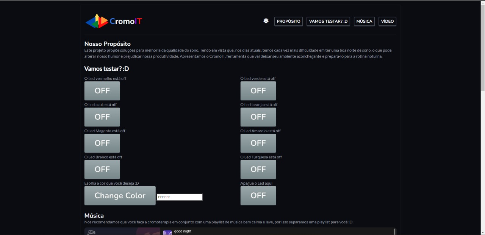
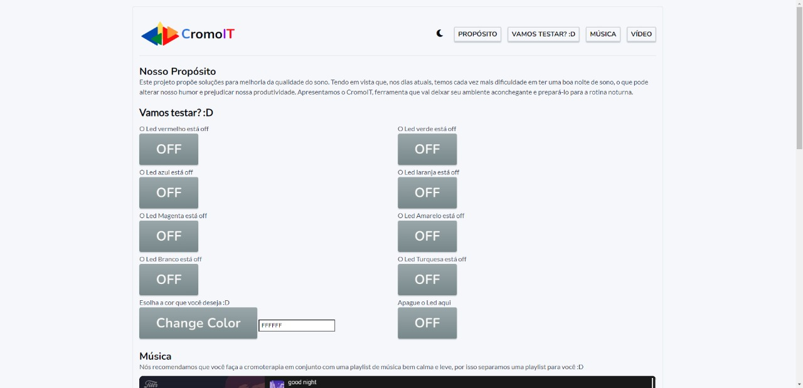
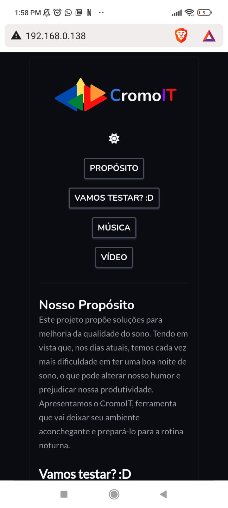

<h1>Cromo IT</h1>

<!-- LINKS -->

 
 <h2> Sumário</h2>
 
 <a href="#fotos">Fotos</a> - 
  <a href="#GIFs">GIFs</a> - 
  <a href="#sobre">Sobre o Projeto</a> - 
  <a href="#tec">Tecnologias</a>

 

<!-- FOTOS -->

    <h2> 📸 Fotos </h2>
        
          
        
       
 <h2> 📱 Responsivo </h2>
        
          
        
        

 

<!-- SOBRE -->

    <h2> 📝 Sobre o Projeto </h2> 
    
 Pensado exatamente para melhorar a qualidade do seu sono, nós, da CromoIT, fizemos uma vasta pesquisa sobre a cromoterapia e seus benefícios.
        Com isso, elaboramos este projeto através de uma placa ESP-8266 e uma fita de led endereçável, nele contém algumas terapais com as mais diversas
        funções. Ficou  interessado?? Pq não testa o nosso produto??? :D

 

 

<!-- TECNOLOGIAS -->

<h2> 🖥️ Tecnologias</h2>
    
 ✔️ HTML 5 

    
 ✔️ CSS 3 

    
 ✔️ JavaScript 

    
 ✔️ C++ 

    
 ✔️ Placa ESP-8266

